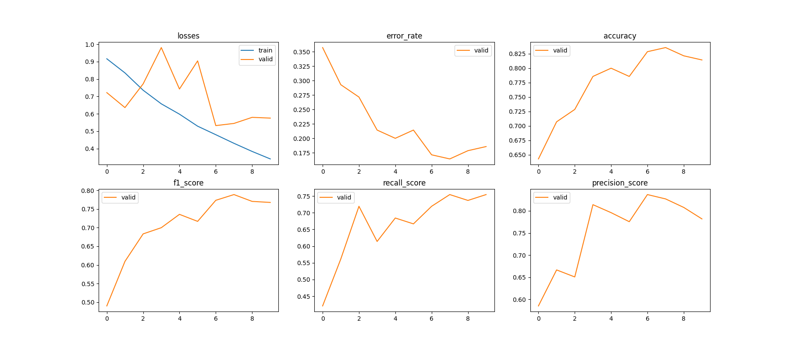
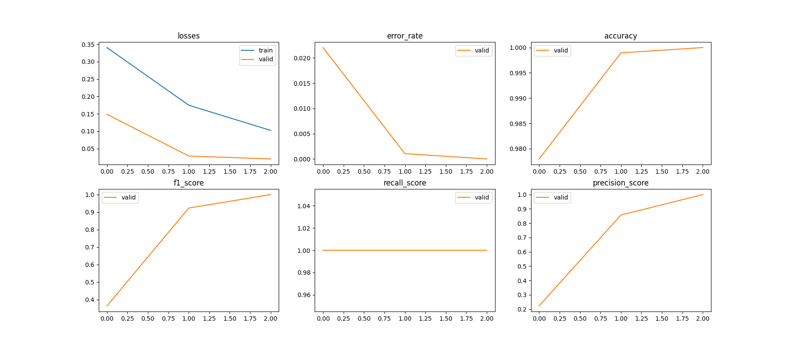
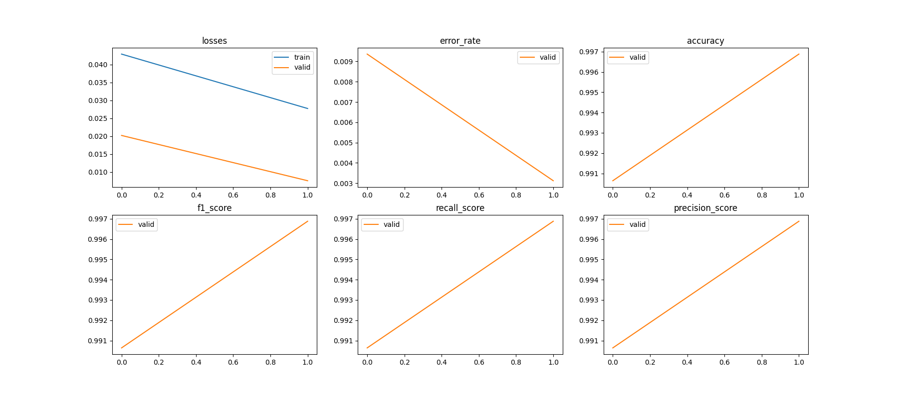
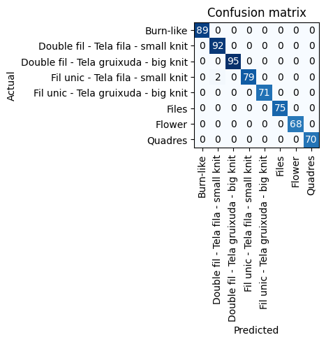
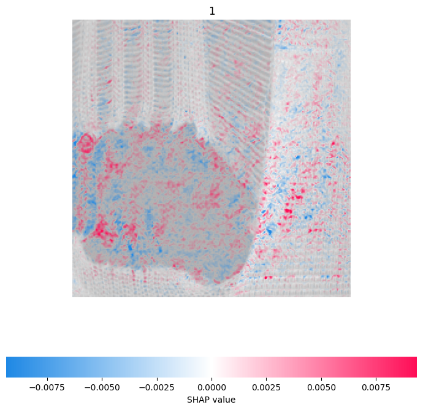
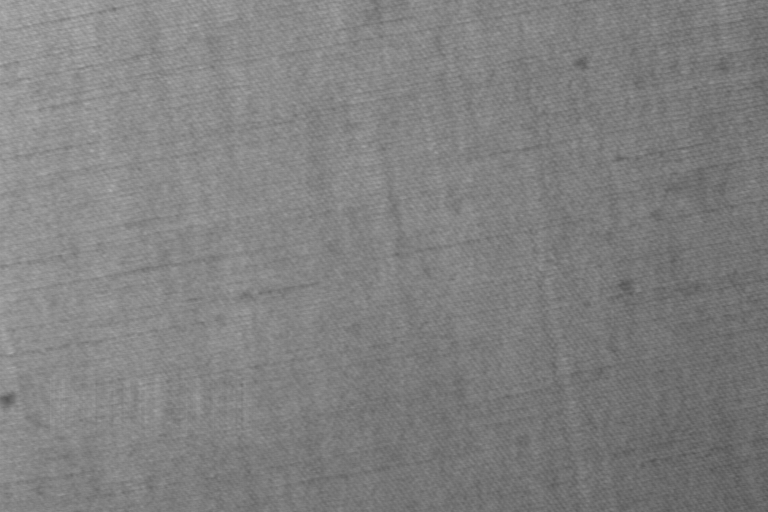

# What is this?

A presentation to the Eurecat 2022 HackEPS challenge.

# Completed challanges

EVERYTHING! Everything was completed in time!

# How good is it?

REALLY good actually. It took a lot of sweat, tears, lack of sleep and copy paste in notebooks, but we did it!

# Explain a little bit how it works

We are using fastAI because it allows us to quickly leverage transfer learning with resnet and get it working locally. The bottleneck on this hackathon has been the CPU, not development itself.

Many models can be improved with many more training hours.

# How was it tested?

FastAI does an automatic 80/20 split, see: https://forums.fast.ai/t/clarification-on-training-validation-testing-sets/87707/2

# How good is each challenge individually?

- Yellow/Red should be perfect or almost perfect
- Orange should be pretty decent, with 90% > accuracy and pretty good f1 scores
- Purple should be REALLY good, with ~99% accuracy and f1 scores
- Green is quite good, BUT some labels are missing on the dataset due to an issue on available data.
- Black is excellent. We have used shap successfully
- Pink is perfect on most images, on some edge-cases it can be improved

# Yellow Challenge

Code in `a1_a2.py` and solution in `a1.md` and `a1.csv`.

# Red Challenge

Code in `a1_a2.py` and solution in `a2.csv`.

# Orange Challenge

Code in `train_a2.py` and solution in `orange` and `orange_pred.csv`.

# Green Challenge

Code in `train_green.ipynb` and `predict_green.py` and solution in `green_pred.csv` and `green`.

# Purple Challenge

Code in `train_purple.ipynb` and `predict_purple.py` and solution in `purple` and `purple_pred.csv`.

# Black Challenge

Code in `explainable_black.ipynb` and solution in `black`.

# Pink Challenge

Code in `correct_pink.ipynb` and solution in `examples_pink`.

